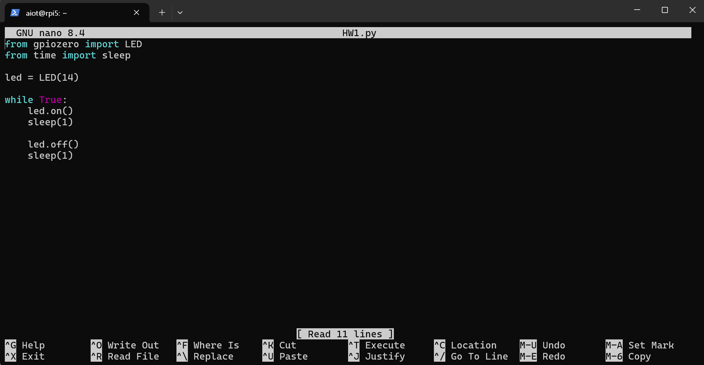
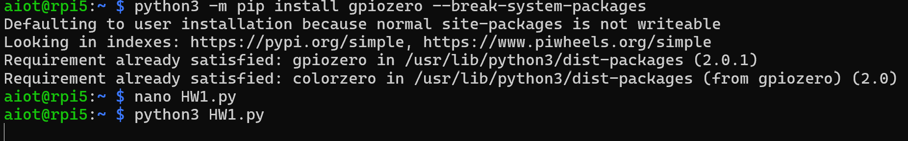
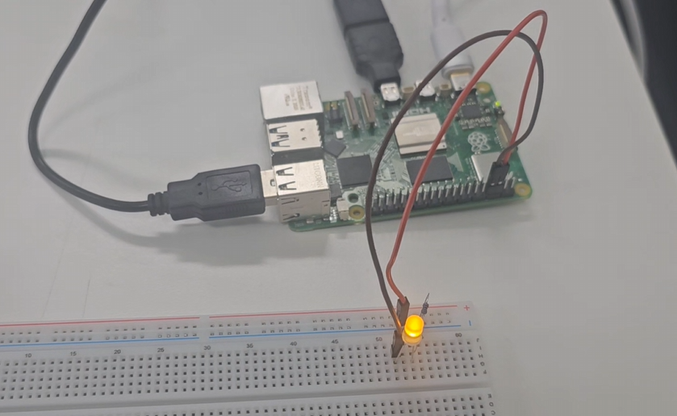

https://github.com/user-attachments/assets/e28c6f51-d8af-4721-b252-b1c6c9041978

# IoT26-HW01

## Control Raspberry Pi Digital Outputs with Python

## 1. Objective

The objective of this assignment is to control Raspberry Pi GPIO pins as digital outputs using Python.

In this project, an LED is connected to a Raspberry Pi GPIO pin and controlled using the `gpiozero` library. The LED repeatedly turns on and off using a Python program.

## 2. Components

- Raspberry Pi
- LED
- Resistor
- Breadboard
- Jumper wires

## 3. GPIO Pins

| Component | GPIO Pin |
|---|---|
| LED | GPIO14 |

## 4. Source Code

```python
from gpiozero import LED
from time import sleep

led = LED(14)

while True:
    led.on()
    sleep(1)

    led.off()
    sleep(1)
```

## 5. How to Run

```bash
python3 HW1.py
```

## 6. Result

The Raspberry Pi successfully controls the LED through GPIO14.

The LED turns on for 1 second and turns off for 1 second repeatedly.

This confirms that the Raspberry Pi GPIO pin can be controlled as a digital output using Python.

## 7. Screenshots and Evidence

### Source Code Screenshot



### Running Program Screenshot



### Raspberry Pi LED Result


https://github.com/user-attachments/assets/4e4a76b1-ff0c-4949-b282-8a08989af6c1




## 8. Members

- 장동현 / AI·소프트웨어학부 소프트웨어전공
- 임규민 / AI·소프트웨어학부 인공지능전공
- 이형호 / AI·소프트웨어학부 인공지능전공
